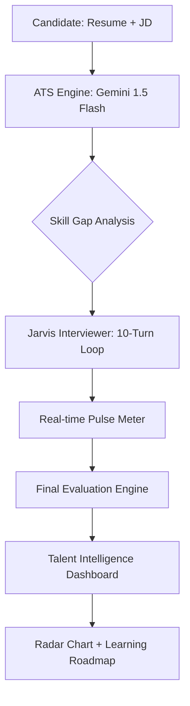

# 🤖 SkillSync AI - Jarvis Assessment Platform

**SkillSync AI** is a state-of-the-art, AI-powered interviewing platform featuring **Jarvis**, an advanced technical recruiter. Built for the **Catalyst Hackathon**, this platform bridges the gap between what a resume *claims* and what a candidate *actually* knows.

---

## 🎯 Problem Statement
> "A resume tells you what someone claims to know — not how well they actually know it."

SkillSync AI overcomes this by transforming static resumes into interactive technical assessments. It provides companies with verified proficiency data and provides candidates with a roadmap to bridge their identified skill gaps.

---

## 🔑 SETUP FOR JUDGES (Zero-Setup Guide)

To run this project immediately, follow these simple steps:

1.  **Clone the Repository**:
    ```bash
    git clone https://github.com/mokshagnakakumanu/SOUL_AI_Hackathon.git
    cd SOUL_AI_Hackathon/agent
    ```
2.  **Create your Environment File**:
    Create a file named `.env` in the `agent/` folder:
    ```bash
    touch .env
    ```
3.  **Add the API Key**:
    Paste the following line into your `.env` file (Go to Google AI Studio and generate an API Key and paste it in the .env file):
    ```env
    GEMINI_API_KEY=PASTE_KEY_HERE
    ```
4.  **Install and Run**:
    ```bash
    npm install
    npm run dev
    ```
    Visit [http://localhost:3000](http://localhost:3000).

---

## 🚀 Key Features

- **🔍 Intelligent ATS Pre-Screening**: Semantic analysis of Resume vs. JD to identify hidden gaps.
- **🎙️ Jarvis AI Interviewer**: A high-fidelity, 10-turn technical deep-dive assessment.
- **📈 Live Performance Pulse**: A real-time confidence meter that reacts to technical depth.
- **📊 Talent Intelligence Dashboard**: Visual Radar Chart mapping Proficiency, Logic, and Communication.
- **📄 Personalized Upskilling**: Curated resources and time estimates for every identified gap.

---

## 🏗️ System Architecture



### 🧠 Scoring & Evaluation Logic
SkillSync uses a **Weighted Hybrid Scoring Model** (10% ATS / 90% Interview) and deterministic `temperature: 0` logic to ensure 100% fairness and merit-based results.

---

## 📂 Project Structure
- `/agent/src/app/api`: Scoring engines and Chat Logic.
- `/agent/src/app/components`: The modular UI framework.
- `/datasets`: Sample Resumes and JDs for verification.

---

## 🏆 Credits
Developed by **Mokshagna Kakumanu** for Catalyst.
🚀 *Bridging the gap between claims and reality.*
