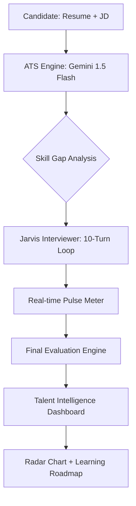

# 🤖 SkillSync AI - Jarvis Assessment Platform

**SkillSync AI** is a state-of-the-art, AI-powered interviewing platform featuring **Jarvis**, an advanced technical recruiter. Built for the **Catalyst Hackathon**, this platform bridges the gap between what a resume *claims* and what a candidate *actually* knows.

---

## 🎯 Problem Statement
> "A resume tells you what someone claims to know — not how well they actually know it."

SkillSync AI overcomes this by transforming static resumes into interactive technical assessments. It provides companies with verified proficiency data and provides candidates with a roadmap to bridge their identified skill gaps.

---

## 🚀 Key Features

- **🔍 Intelligent ATS Pre-Screening**: Semantic analysis of Resume vs. JD to identify hidden gaps.
- **🎙️ Jarvis AI Interviewer**: A high-fidelity, 10-turn technical deep-dive assessment.
- **📈 Live Performance Pulse**: A real-time confidence meter that reacts to technical depth.
- **📊 Talent Intelligence Dashboard**: Visual Radar Chart mapping Proficiency, Logic, and Communication.
- **📄 Personalized Upskilling**: Curated resources and time estimates for every identified gap.

---

## 🏗️ System Architecture



### 🧠 Scoring & Evaluation Logic
SkillSync uses a **Weighted Hybrid Scoring Model** to ensure technical merit outweighs resume presentation:
1. **ATS Alignment (10%)**: Initial semantic match between JD and Resume.
2. **Interview Proficiency (90%)**: The core score. Jarvis evaluates answers based on:
   - **Technical Depth**: Correctness and detail of the explanation.
   - **Architecture**: Understanding of system-wide implications.
   - **Logic & Problem Solving**: The approach to complex scenarios.
   - **Communication**: Clarity and professional delivery.

**Deterministic Logic**: All AI calls use `temperature: 0` to ensure that the same answer always receives the same score, maintaining 100% fairness for all candidates.

---

## 💻 Local Setup Instructions

1. **Clone & Install**:
   ```bash
   git clone https://github.com/mokshagnakakumanu/SOUL_AI_Hackathon.git
   cd SOUL_AI_Hackathon/agent
   npm install
   ```
2. **Configure Environment**:
   Create `.env` in the `agent/` folder:
   ```env
   GEMINI_API_KEY=your_key_here
   ```
   *(Note: A public key is currently provided in the repo for judge's convenience).*

3. **Run**:
   ```bash
   npm run dev
   ```
   Visit [http://localhost:3000](http://localhost:3000).

---

## 📂 Project Structure
- `/agent/src/app/api`: Scoring engines and Chat Logic.
- `/agent/src/app/components`: The modular UI framework.
- `/datasets`: Sample Resumes and JDs for verification.

---

## 🏆 Credits
Developed by **Mokshagna Kakumanu** for Catalyst.
🚀 *Bridging the gap between claims and reality.*
